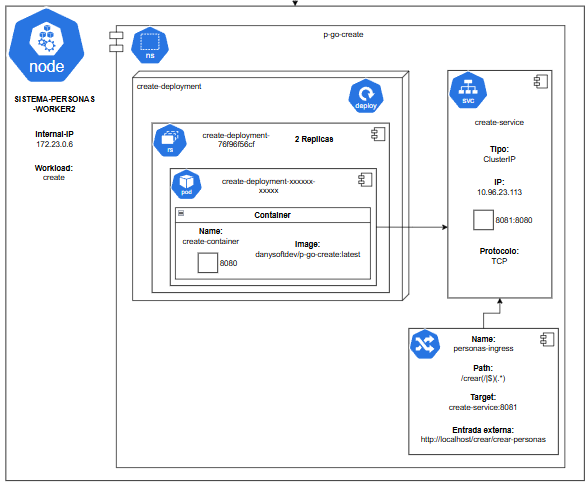

# 🧩 p-go-create

Microservicio en Go para la **creación de personas**, con persistencia en MongoDB, pruebas unitarias e integración, y despliegue automatizado con Docker Compose y GitHub Actions.

---

## 📦 Tecnologías utilizadas

- 🧠 **Golang 1.21+**
- 🗄️ **MongoDB**
- 🐳 **Docker & Docker Compose**
- ✅ **Testify** (pruebas unitarias)
- 🧪 **Testcontainers-Go** (pruebas de integración)
- 🔁 **GitHub Actions** (CI/CD)
- 🔐 `.env` para configuración centralizada

---

## 🚀 Cómo levantar el microservicio localmente

### 1. Clona el repositorio

```bash
git clone https://github.com/tu_usuario/p-go-create.git
cd p-go-create
```

### 2. Crea el archivo `.env` con:

```env
MONGO_ROOT_USER=<tu_usuario_mongo>
MONGO_ROOT_PASS=<tu_contraseña_mongo>
MONGO_DB=<nombre_base_datos>
MONGO_HOST=<host_mongo>
MONGO_PORT=<puerto_mongo>
MONGO_URI=mongodb://<usuario>:<contraseña>@<host>:<puerto>/<base_datos>?authSource=admin
COLLECTION_NAME=<coleccion_personas>
```

### 3. Crea la red compartida (si no existe)

```bash
docker network create parcial_go_mongo_net || true
```

### 4. Levanta MongoDB

```bash
docker compose -f docker-compose-mongo.yml --env-file .env up -d
```

### 5. Levanta el microservicio

```bash
docker compose --env-file .env up -d
```

---

## 🌐 Endpoint disponible

### `GET /`

- **URL:** `http://localhost:8081/`
- **Descripción:** Verifica que el servicio está levantado
- **Respuesta esperada:**

```text
Hola, desde la creación de personas
```

### `POST /crear-personas`

- **URL:** `http://localhost:8081/crear-personas`
- **Headers:** `Content-Type: application/json`
- **Body:**

```json
{
  "documento": "12345678",
  "nombre": "Angie",
  "apellido": "Díaz",
  "edad": 25,
  "correo": "angie@example.com",
  "telefono": "3120000000",
  "direccion": "Cra 1 #1-1"
}
```

---

## 🧪 Ejecución de pruebas

### ✅ Pruebas unitarias

```bash
go test -v ./... -tags='!integration' -cover
```

### 🧪 Pruebas de integración (Testcontainers)

```bash
go test -v ./... -tags=integration
```

---

## 🧪 Pruebas con Docker Compose (`tester`)

El archivo `docker-compose.yml` contiene un servicio `tester` con el perfil `test` que se puede ejecutar así:

```bash
docker compose --env-file .env --profile test up --abort-on-container-exit
```

Esto:

- Levanta `create-service`
- Espera 10 segundos
- Ejecuta un `curl` a `/` para confirmar que está respondiendo correctamente
- Termina automáticamente

---

## 🔁 CI/CD con GitHub Actions

El repositorio incluye un flujo de trabajo automático (`.github/workflows/docker-image.yml`) que realiza:

- ✔️ Ejecución de pruebas unitarias
- ✔️ Ejecución de pruebas de integración
- ✔️ Levanta MongoDB y el microservicio con Docker Compose
- ✔️ Prueba del servicio vía `tester`
- ✔️ Escaneo de vulnerabilidades con Trivy
- ✔️ Publicación de imágenes en:
  - **GitHub Container Registry**
  - **DockerHub**
- ✔️ Creación de releases automáticos con tags `vX.Y.Z`

### 📄 Fragmento relevante del workflow:

```yaml
- name: ✅ Run Unit Tests
  run: go test -v ./... -tags='!integration' -cover

- name: 🧪 Run Integration Tests
  run: go test -v ./... -tags=integration

- name: 🧱 Run MongoDB via Docker Compose
  run: docker compose -f docker-compose-mongo.yml --env-file .env up -d

- name: 🔁 Run Docker Compose Integration Test
  run: docker compose --env-file .env --profile test up --abort-on-container-exit
```

---

## 📁 Estructura del proyecto

```
p-go-create/
├── controllers/                  # Handlers HTTP
├── models/                       # Estructuras de datos
├── repositories/                 # Conexión a MongoDB
├── services/                     # Lógica de negocio y pruebas
├── tests/                        # Mocks y utilidades de test
├── docker-compose.yml            # Compose del microservicio y tester
├── docker-compose-mongo.yml      # Compose de MongoDB
├── Dockerfile                    # Imagen de Go
├── .env                          # Variables de entorno
├── go.mod / go.sum               # Dependencias de Go
├── main.go                       # Punto de entrada
└── README.md                     # Este documento
```

---

## Diagrama de infraestructura




## 📜 Licencia

Este proyecto está bajo la licencia MIT.  
© Daniela Villalba Torres – 2025.